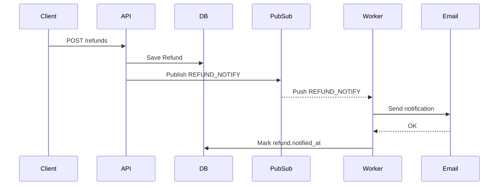

# Doc Skill — Documentation Conventions (FastAPI)

This skill is consumed exclusively by the Doc Agent.
It defines WHERE documentation lives, in WHAT FORMAT, and the
FastAPI-specific conventions that must be respected.

The core principle: in FastAPI, the OpenAPI spec is **generated
from the code**. Most "documentation" work is about writing the
code so that the generated spec is accurate, complete, and clear —
not about hand-writing YAML.

---

## Documentation Locations

| Artifact                       | Location                                    |
|--------------------------------|---------------------------------------------|
| OpenAPI spec                   | auto-generated by FastAPI (`/openapi.json`)|
| Interactive docs (Swagger UI)  | auto-served at `/docs`                      |
| Interactive docs (ReDoc)       | auto-served at `/redoc`                     |
| Exported OpenAPI snapshot      | `{TO_FILL: e.g., docs/openapi.json}`        |
| Feature READMEs                | `{TO_FILL: e.g., docs/features/}`           |
| Main README                    | `README.md` (project root)                  |
| Code docstrings                | inline in source files                      |
| Job documentation              | `{TO_FILL: e.g., docs/jobs/}`               |

**Customize the locations above for this project before first use.**

---

## FastAPI OpenAPI Strategy

```
You DO NOT hand-write OpenAPI YAML in FastAPI.
You write Python code that produces a correct OpenAPI spec.

The Doc Agent's job for API endpoints is to ensure that:
  1. The route decorator carries the right metadata
  2. Pydantic models carry the right metadata
  3. The OpenAPI spec generated from the code is accurate
  4. An exported snapshot is committed when conventions require it
```

---

## Route Documentation Pattern

Every FastAPI route must include:

```python
@router.post(
    "/refunds",
    response_model=RefundRead,
    status_code=status.HTTP_201_CREATED,
    summary="Create a refund",
    description=(
        "Allows an admin to create a partial or full refund "
        "on an existing payment. The refund is created in "
        "'pending' status and a notification job is enqueued."
    ),
    tags=["refunds"],
    responses={
        400: {"model": ErrorResponse, "description": "Validation error"},
        401: {"model": ErrorResponse, "description": "Not authenticated"},
        403: {"model": ErrorResponse, "description": "Not an admin"},
        404: {"model": ErrorResponse, "description": "Payment not found"},
        409: {"model": ErrorResponse, "description": "Payment already fully refunded"},
    },
)
async def create_refund(
    payload: RefundCreate,
    current_user: User = Depends(get_current_admin),
) -> RefundRead:
    """Create a refund for a payment.

    Business rules:
    - Only admins can create refunds.
    - Amount must be > 0 and <= remaining refundable amount on the payment.
    - The created refund is immediately enqueued for customer notification.
    """
    ...
```

### Required fields per route

- `summary` — short one-liner (shows in route list)
- `description` — multi-line, explains behavior (shows in expanded view)
- `tags` — resource grouping (use the resource name in lowercase plural)
- `response_model` — typed return shape (drives the 2xx schema)
- `status_code` — explicit success status (don't rely on default 200)
- `responses` — every documented error status code with a model

### Tags convention

```
One tag per resource, lowercase plural.
Examples: ["refunds"], ["payments"], ["users"]

Register tag metadata in the FastAPI app setup so each tag has
a description in the generated docs.
```

---

## Pydantic Model Documentation Pattern

Every Pydantic model that appears in a request or response must
carry field-level metadata for the generated schema.

```python
from decimal import Decimal
from datetime import datetime
from pydantic import BaseModel, Field, ConfigDict


class RefundCreate(BaseModel):
    """Payload for creating a refund."""

    model_config = ConfigDict(
        json_schema_extra={
            "example": {
                "payment_id": 123,
                "amount": "50.00",
                "reason": "customer requested",
            }
        }
    )

    payment_id: int = Field(
        ...,
        gt=0,
        description="ID of the payment to refund.",
    )
    amount: Decimal = Field(
        ...,
        gt=0,
        max_digits=10,
        decimal_places=2,
        description="Refund amount. Must be > 0 and <= remaining refundable amount.",
    )
    reason: str = Field(
        ...,
        min_length=1,
        max_length=500,
        description="Free-text reason for the refund.",
    )


class RefundRead(BaseModel):
    """Refund returned by the API."""

    model_config = ConfigDict(from_attributes=True)

    id: int = Field(..., description="Refund identifier.")
    payment_id: int = Field(..., description="Associated payment ID.")
    amount: Decimal = Field(..., description="Refund amount.")
    reason: str = Field(..., description="Reason for the refund.")
    status: str = Field(..., description="Refund status (pending, completed, failed).")
    created_at: datetime = Field(..., description="Refund creation timestamp.")
```

### Required on every field

- Type hint (required by FastAPI / Pydantic)
- `Field(...)` with `description=` for every public field
- Validation constraints (`gt`, `min_length`, `max_length`, etc.) when applicable
- Example value via `model_config.json_schema_extra.example` at model level

### Optional but recommended

- `model_config.from_attributes=True` for ORM-mapped read models
- `Annotated[Type, Field(...)]` style if the project uses it consistently

---

## Error Response Schema

Define a single shared error model used across all 4xx responses.

```python
from pydantic import BaseModel, Field


class ErrorResponse(BaseModel):
    """Standard error envelope."""

    detail: str = Field(..., description="Human-readable error description.")
    code: str | None = Field(
        default=None,
        description="Machine-readable error code (e.g., 'PAYMENT_NOT_FOUND').",
    )
```

Use `responses={4xx: {"model": ErrorResponse, ...}}` on every route
so the generated OpenAPI spec includes error schemas, not just
empty descriptions.

---

## Dependencies and Security in Docs

When a route uses `Depends(...)` for authentication or authorization,
the OpenAPI spec reflects this automatically — provided the
dependency is built with a `Security` scheme.

```python
from fastapi import Depends, HTTPException, status
from fastapi.security import HTTPBearer

bearer_scheme = HTTPBearer()


async def get_current_admin(
    credentials = Depends(bearer_scheme),
) -> User:
    ...
```

Routes depending on `get_current_admin` will then show a lock
icon in Swagger UI and a `security` entry in the OpenAPI spec.

When a route is intentionally public:
- Use `include_in_schema=True` (default) — still in the spec
- Add a note in the description: "Public endpoint, no authentication."

When a route should be hidden from the spec entirely (internal,
worker endpoints, health checks):
- Use `include_in_schema=False`

---

## OpenAPI Snapshot (exported file)

If the project commits an exported OpenAPI snapshot:

```python
# scripts/export_openapi.py
import json
from app.main import app

with open("docs/openapi.json", "w") as f:
    json.dump(app.openapi(), f, indent=2, sort_keys=True)
```

The Doc Agent regenerates the snapshot at the end of each Work Unit
that touches public endpoints, and commits the updated file.

---

## Markdown Feature READMEs

For documenting a complete feature beyond the auto-generated spec:

```markdown
# Refunds

## What it does
Admins can create partial or full refunds on existing payments.
A notification is sent to the customer when a refund is created.

## API
See the auto-generated docs at `/docs` (Swagger UI) or `/redoc`.

Key endpoints:
- `POST /refunds` — create a refund (admin only)
- `GET /refunds` — list refunds (admin only, paginated)
- `GET /refunds/{id}` — retrieve a refund (admin only)

## Async jobs
- `REFUND_NOTIFY` — sends a notification to the customer after
  a refund is created. Idempotent on retry.

## Data model
- `Refund` — new entity (amount, reason, status, payment_id, created_at)
- `Payment` — added `refund_count` field

## Configuration
- `EMAIL_BACKEND` — must be configured for notifications
- `REFUND_MAX_AMOUNT_RATIO` — optional, defaults to 1.0 (full refund allowed)

## Examples

Create a refund:
```bash
curl -X POST https://api.example.com/refunds \
  -H "Authorization: Bearer <admin-token>" \
  -H "Content-Type: application/json" \
  -d '{
    "payment_id": 123,
    "amount": "50.00",
    "reason": "customer requested"
  }'
```
```

---

## Async Jobs Documentation

Async jobs are not part of the OpenAPI spec. They are documented
in markdown.

```markdown
# Refund — Async Jobs

## Job: REFUND_NOTIFY

**Trigger:** published from `POST /refunds` after the refund is committed.

**Payload:**
```json
{
  "refund_id": 1
}
```

**Behavior:**
- Loads the Refund by ID.
- Renders the "refund_completed" notification template.
- Sends the notification to the customer.
- Marks `refund.notified_at` on success.

**Idempotence:** if `refund.notified_at` is already set, the handler
returns immediately without re-sending.

**Failure modes:**
- Refund not found → non-retryable, logged and dropped.
- Notification provider transient error → retryable per project conventions.
- Notification provider auth error → non-retryable, alerts the team.
```

---

## Docstring Style (FastAPI / Python)

### Format
```
{TO_FILL: e.g., Google style / NumPy style / reST}
Default for new FastAPI projects: Google style.
```

### Where docstrings matter

- **Route handlers** — the docstring shows up below the `description=`
  in the generated docs. Keep it focused on business rules and
  invariants, not on parameter types (those come from signatures).

- **Public functions and classes** — standard Google-style docstrings.

- **Service functions called by handlers** — short docstring explaining
  what the function does, raises, and returns.

### Example (Google style)

```python
async def create_refund(
    payment_id: int,
    amount: Decimal,
    reason: str,
    *,
    session: AsyncSession,
) -> Refund:
    """Create a refund for a payment.

    Args:
        payment_id: ID of the payment to refund. Must exist.
        amount: Refund amount. Must be > 0 and <= remaining refundable.
        reason: Free-text reason for the refund.
        session: Async DB session, injected by the caller.

    Returns:
        The created Refund instance, with status='pending'.

    Raises:
        PaymentNotFound: If payment_id does not exist.
        InvalidRefundAmount: If amount is invalid for this payment.
    """
```

### What docstrings should NOT contain

- Implementation details (those belong in code comments)
- TODO / FIXME (use issue tracker instead)
- Author / date (git history covers this)
- Information that duplicates `Field(description=...)` on Pydantic models

---

## Diagrams

When a diagram clarifies more than text:

- Prefer **mermaid** code blocks for inline rendering in markdown
- For OpenAPI flows, leave diagrams out of the spec — keep them
  in feature READMEs



---

## Cross-References

- Markdown docs use **relative links** (`[Refunds API](../api/refunds.md)`)
- Link to generated docs using the public URL pattern:
  - Swagger UI: `/docs#/refunds/create_refund_refunds_post`
  - ReDoc: `/redoc#operation/create_refund_refunds_post`
  - These anchors are based on FastAPI's auto-generated `operationId`.

If the project enforces stable `operationId`s, set them explicitly:

```python
@router.post("/refunds", operation_id="create_refund", ...)
```

This makes the generated anchors and SDK client method names stable
across refactors.

---

## Vocabulary Rules

### Allowed in user-facing documentation
```
endpoint, request, response, payload, job, handler, worker,
schema, model, field, dependency, permission, authentication,
error code, status code, retry, schedule, event, publisher, subscriber
```

### FORBIDDEN in user-facing documentation
```
Work Unit, agent, queue, lifecycle, dispatch table, orchestrator,
status.json, depends_on, active_agents, READY signal, workload,
Planner, factory, pipeline (in the internal sense)
```

Internal factory mechanics never leak into user docs.

---

## Quality Bar

Before signaling a Doc Work Unit as done:

```
For an API endpoint unit:
[ ] Route decorator has summary, description, tags, response_model,
    status_code, and responses for every documented status code
[ ] Pydantic models have field-level descriptions on every public field
[ ] Pydantic models have a model-level example via
    json_schema_extra.example
[ ] Error responses use the shared ErrorResponse model
[ ] operation_id is explicit and stable
[ ] Generated /docs page renders the endpoint with full schema + example
[ ] OpenAPI snapshot regenerated (if the project commits one)

For an async job unit:
[ ] Job documented in markdown with trigger, payload, behavior,
    idempotence note, failure modes
[ ] Linked from the feature README if applicable

For a README unit:
[ ] "What it does" section in plain English
[ ] API summary with links to /docs (no hand-duplicated specs)
[ ] Async jobs summary
[ ] Data model summary
[ ] Configuration / env vars
[ ] At least one realistic example
```

---

## Anti-Patterns to Avoid

- Hand-writing OpenAPI YAML alongside FastAPI — the spec drifts
- Routes with no `summary` or no `description` — empty docs
- Pydantic fields without `description=` — empty schema
- Error responses without `model=ErrorResponse` — opaque 4xx
- Generic examples (`"string"`, `0`, `"2024-01-01"`) — write realistic ones
- Documenting future behavior as if it exists
- Duplicating Pydantic field descriptions in route docstrings
- Skipping `operation_id` — anchors break on rename

---

## When to ask vs assume

The Doc Agent should write an anomaly when:

- The upstream contract (endpoints.md, jobs.md) is missing error
  codes that need to appear in `responses={...}`
- The behavior description in the upstream contract is ambiguous
- The schema example would contradict the documented field constraints
- The authentication/permission dependency for a route is not stated

Documentation must reflect what the code does — never invent
behavior to fill gaps.